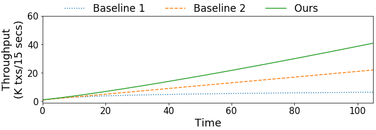

# Paper Plot

[](./LICENSE)

A Python library that helps you plot figures that are used on your paper for your experiment results. The library is based on `matplotlib` but provides a way to constrcut plots using builder pattern.

## Requirements

- Python 3
- The following Python libraries:
    - csv
    - matplotlib
    - numpy

## A Quick Example

```python
import paper_plot as pt

pt.lines_from_csv('inputs/introduction.csv', figsize=(10, 3)) \
    .y_label('Throughput\n(K txs/15 secs)').tick_size(15).label_size(18)\
    .line_styles([':', '--', '-']).legend_size(17).legend_out() \
    .legend_ncol(3) \
    .draw().save_as_pdf('outputs/fig-ex-introduction')
```



To see more examples, please see [the example notebook](example.ipynb).

## APIs

### Initialization

This library supports three types of plots:

- line plots: `lines_from_csv(filename, figsize=(-1, -1)): FigureBuilder`
- stack plots: `stacks_from_csv(filename, figsize=(-1, -1)): FigureBuilder`
- group-bar plots: `group_bars_from_csv(filename, figsize=(-1, -1)): FigureBuilder`

You must provide your data in a CSV file and feed the file path to the above APIs. Here is an example of a CSV data file:

```csv
Emulation Time (Hours),Range Partition,Clay,LEAP
0.5,361.117,306.551,441.801
1,433.808,369.98,523.353
1.5,378.642,348.862,468.257
2,409.599,291.14,483.316
2.5,414.794,277.133,534.468
3,415.857,356.452,496.93
```

By calling the above APIs, you will get an instance of `FigureBuilder`.

### Adding Modifiers

After having an instance of `FigureBuilder`, you can then apply modifications to your plot. Note that nothing shows before you call `draw()`. Here are the modifcations we support:

- Set X labels: `x_label(label_name): FigureBuilder`
- Set the size of X labels: `x_label_size(size): FigureBuilder`
- Set Y labels: `y_label(label_name): FigureBuilder`
- Set the size of Y labels: `y_label_size(size): FigureBuilder`
- Set the labels for data: `data_labels(label_names): FigureBuilder`
- Set the labels for groups (only works for group-bar plots): `group_labels(label_names): FigureBuilder`
- Set the size of the legend: `legend_size(size): FigureBuilder`
- Set the number of columns in the legend: `legend_ncol(ncol): FigureBuilder`
- Set the ticks shown on the X axis: `x_ticks(values): FigureBuilder`
- Set the size of ticks: `tick_size(size): FigureBuilder`
- Set the size of labels: `label_size(size): FigureBuilder`
- Set the minimal value of the X axis: `x_min(val): FigureBuilder`
- Set the maximal value of the X axis: `x_max(val): FigureBuilder`
- Set the minimal value of the Y axis: `y_min(val): FigureBuilder`
- Set the maximal value of the Y axis: `y_max(val): FigureBuilder`
- Set the scale of the X axis: `x_scale(val): FigureBuilder`
- Set the scale of the Y axis: `y_scale(val): FigureBuilder`
- Show the legend: `show_legend(): FigureBuilder`
- Pull the legend out from the plot: `legend_out(): FigureBuilder`
- Set the markers on lines (only works for line plots): `markers(markers): FigureBuilder`
- Set the hatches of bars (only works for bar and group-bar plots): `bar_hatches(hatches): FigureBuilder`
- Set the colors of edges: `edge_colors(edge_colors): FigureBuilder`
- Set the colors of lines/bars/group bars: `colors(colors): FigureBuilder`
- Set the styles of lines (only works for line plots): `line_styles(line_styles): FigureBuilder`
- Add a vertical line: `add_vline(x, color='black', linestyle='-'): FigureBuilder`

### Drawing

- Call `draw()` to show the results of your plot on Jupyter Notebooks
- Call `save_as_pdf(filename)` to save the plot as a PDF file. Note that `draw()` must be called before this.
